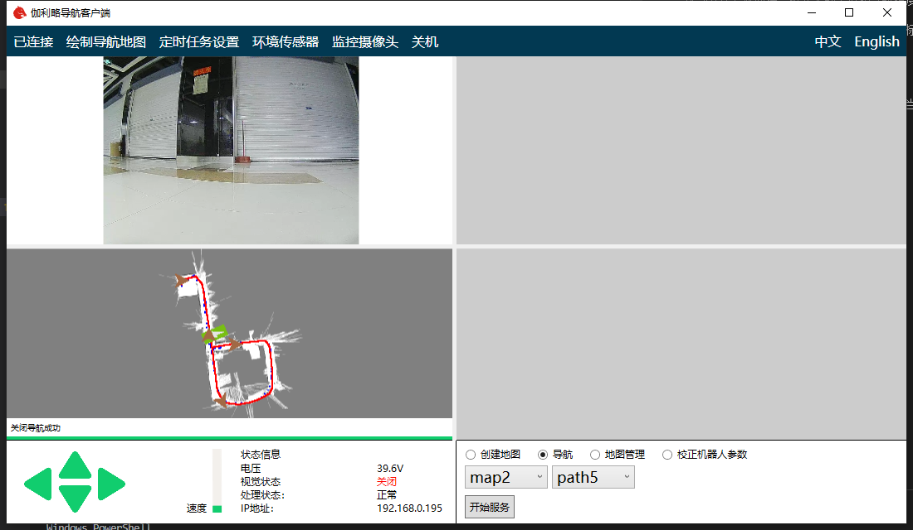
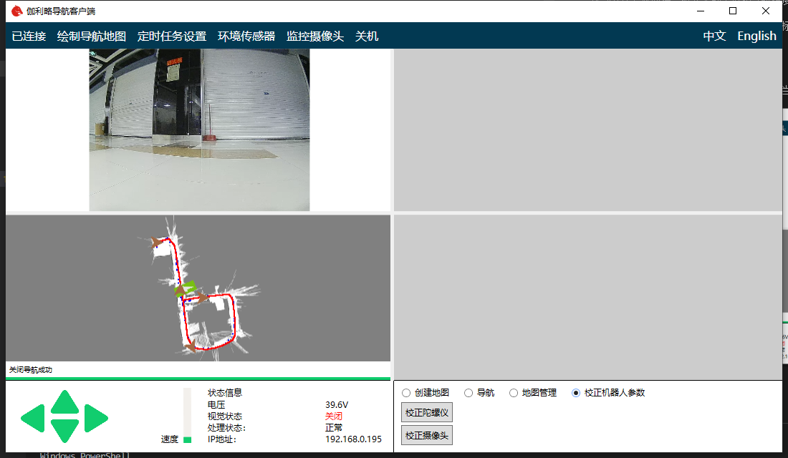
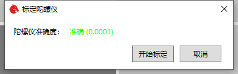
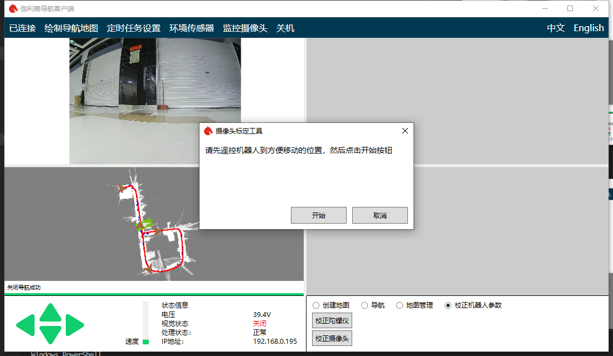
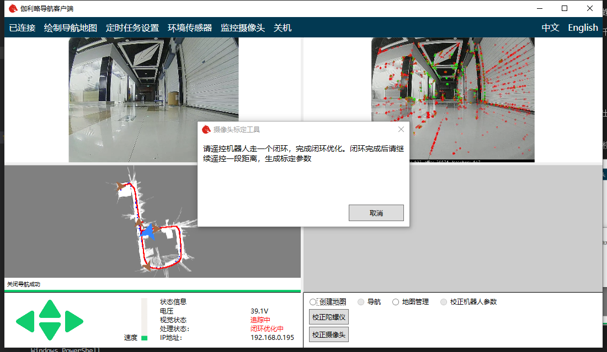
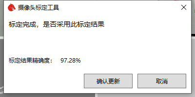

# Chapter5 The Calibration of Robot

In the process of using the robot, due to the robot assembly error. The built-in parameters of the robot and navigation will lead to errors in the actual positioning and positioning of the robot. The robot parameters can be calibrated by using the robot calibration tool, which can reduce the error and improve the positioning and navigation accuracy of the robot.

The calibration of robot consists of two parts. One is IMU calibration, the other is camera calibration.

Demo video

<video src="https://bwbot.org/s/sHt8wN" controls style="max-width: 100%"></video>

## 5.1 IMU calibration

IMU is a kind of equipment used by robot to locate in short distance. First open the client and connect the robot.

Click "Robot Calibration"

Then click IMU Calibration

The IMU calibration window will pop up. The IMU data will be displayed in the window. The smaller the value is, the more accurate IMU is.

Click "Start Calibration" to calibrate. Pay attention not to touch the robot during calibration. This will lead to a large error in calibration. The whole calibration process may take two minutes. Please be patient.

After the calibration is completed, you can close IMU calibration window.

## 5.2 Camera calibration

The camera calibration process requires the remote robot to move around in the environment, so please ensure that there is enough space for the robot to move before starting the calibration.

Click "camera calibration" button in the lower right corner. The camera calibration window will pop up. Then according to your robot, you need to choose the correct button to calibrate the front/back camera or just a single camera.

According to the prompt, remote control the robot to a more open position. Then click the start button.

At this time, the robot will enter the building-map status.

According to the window prompt, move your robot forms a closed-loop.

Wait for the closed-loop to complete, and then continue to move forward for a distance. At this time, the robot will automatically calculate the calibration parameters and errors.

Better results can reach more than 99%. Whether you can accept the calibration depends on the accuracy of the results. If you accept the results, click the confirm Update button.

Now calibration is done.
