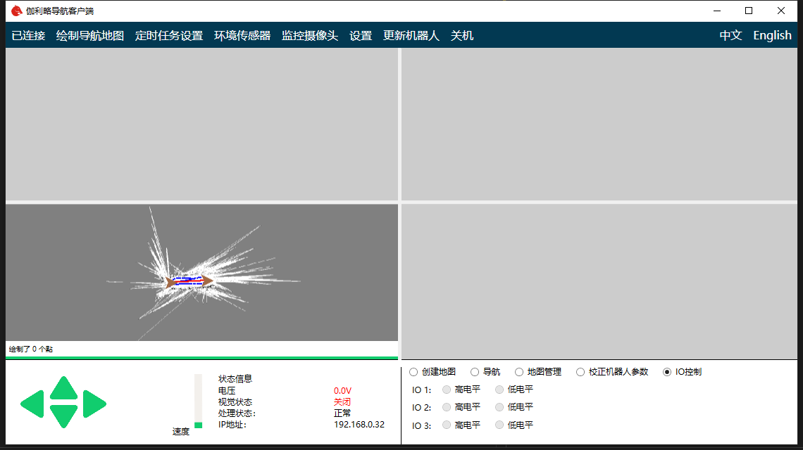

# Chapter7 I/O Control

For some robot scenarios, it is necessary to control the IO of the robot, which can be easily operated through the IO control panel.

After connecting the robot, click the IO control panel in the lower right corner.

As you can see, there are three IO's marked with high level and low level options.

If the robot program does not support the IO control function, the corresponding IO button is disabled. If the robot supports IO control function, the IO control panel will display the current level state of IO corresponding to the robot. If you click the corresponding level option, the program will set the corresponding io of the robot to the level you set.