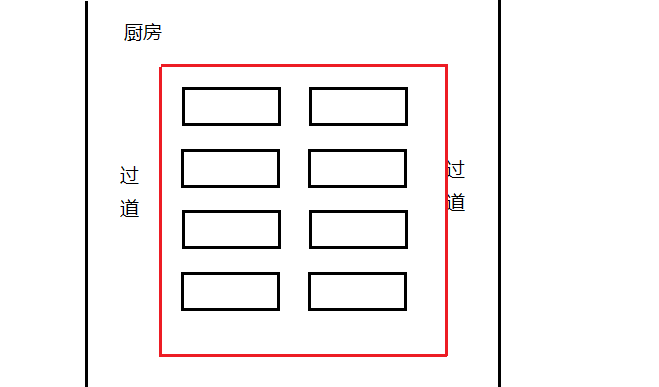

# Chapter3 Vision Navigation

## 3.1 System introduction

The working progress of navigation:

1. After opening the Remote Control with Video, you can bulid a visual map robot can understand by controlling the robot to walk two circles around the sports area.

2. Using our control software to draw manually robot navigation routes and set target points onn the map we build in the step one.

3. Start the service of navigation and choose your target point. The robot will move manually to the target point by the routes set in the step two.

## 3.2 Buliding map

After opening the Remote Control with Video, you need to click “Start mapping” button and wait a moment.

 Right click on the screen2 and choose Feature image in the right-click-menu

Control the robot to go forward until visual system starts successfully

Now control your robot move around the sports area.Please do not turn left/right without pressing front key or back key, it will cause the visual system lost target.

Please ensure Visual Status is `“TRACKING”`. Once it becomes `“LOST”` with red color, you must control the robot to go backward just by pressing back key until the status turns to `“TRACKING”`.

Please do not control the robot when the status turns to`“闭环优化中”`. The section of the robot that the robot has just traveled is a closed loop and can recognize the path. Optimize with the previous path. This closed-loop optimization operation will improve the quality of the map, so it is recommended that the manual remote control robot take more closed paths and optimize the closed-loop of these paths during the construction process. Through such continuous optimization of the map, efficient environment recognition can be achieved when performing tasks or disinfecting.

Buliding map example:

The two sides of this figure are tables, and the middle is an obstacle. The remote control robot first walks clockwise and counterclockwise once according to the maximum outer contour trajectory to achieve "closed-loop optimization" so that we can get a better map.

The quality of map will effect navigation greatly. 

Stop moving after going around the sports area, clicks the "Save Map" button on the main interface, and waits for the save dialog box to pop up. Enter "Map Name" in the dialog, and then click OK. Wait for the map to load.

After loading-map complete, you can see the map on the screen. If you feel well you can click stop mapping and achieve the map-building.

Full demo video：

[How to bulid a map](https://www.bwbot.org/s/Ao2frj)

## 3.3 Draw mavigation path & Set target point

`Warning：Please be patient and waiting for the update of UI, because it will take a long time to exchange data between the robot and software while we run the operation of section3.3.`

After connecting to the robot successfully, click the "Draw Navigation Map" button on the upper menu bar of the main interface to open the navigation path editing interface.

UI just like the image below. 

### 3.3.a Draw navigation path

The navigation path is the path you want the robot to walk. Click "start navigation" on the main interface, the robot will move according to the path you draw. Here's how to use the path drawing tool.

-  1. Basic operation

  Basic operations include pan and zoom. Drag the map with the left mouse button to pan the map. Scrolling the mouse wheel forward and backward can zoom the map, which is very useful in drawing the path. For the places where the movement requirements are more detailed, you can zoom in and draw.
-  2. Pencil tool

  Click the pencil-like icon in the toolbar on the left. This is the linear tool. Use the left mouse button to click a point on the graph as the starting point, and then move the mouse, a red line will appear, move the mouse to the desired end position, click the left mouse button again, a line will be drawn. If you want to draw a polyline, you can click twice in a row at the turning point.
-  3. raser tool
  
  Click the eraser tool in the left toolbar, and then drag with the left mouse button to erase the previously drawn points. The erasing range of the eraser is very small, the delete operation is recommended to use the following delete tool.
-  4. Curve tool
  
  Click the left curve tool, click the left mouse button at the starting point of the curve, then click the left mouse button again in the middle of the curve, and finally click the left mouse button at the end point of the curve. Such a curve is drawn. Note that if you want the robot to walk closer to the planned route or smooth walking, it is recommended to use this tool to adjust the turning radius of the corner.
-  5. Removal tool
  
  If you want to delete the previously drawn points on a large scale, you can use this deletion tool. Click the delete tool on the left and then click the starting point of the deletion with the left mouse button. You can see that a rectangle has been following during the movement of the mouse. Click the left mouse button again to delete the selected area of ​​the rectangle.

Using these tools, you can draw the robot's navigation route. Pay attention to try to follow the original trajectory (blue dot) to draw the line, so as to ensure that the robot can move smoothly in the planned route. There are dense black spots around the map that are the boundaries of the area or the outline of obstacles. These points can roughly reflect the surrounding state. For the robot mode, the trajectory is connected.

### 3.3.b Set target point

For robot application scenarios, the robot needs to move back and forth between several fixed positions. For example, walk from the kitchen to table one, and then return to the kitchen to table two and so on. The following work is to mark the location of each target point on the route drawn above. After that, we can send the corresponding target point to the robot, and then let the robot automatically go to the target point.

Click to activate the navigation target point insertion tool, and click on the navigation route in turn to insert the navigation target point. You can also use the eraser and delete tools to delete the navigation target point.

The selected target point is green, and its map information will be displayed in the site properties window on the right. `ATTENTION: Point 0 access to the kitchen in food-delivered method.`

Site attribute description:
(1) To switch sites, you need to use the site switch button on the upper side of the site properties window to switch.
(2) To accurately adjust the position of the station, the position of the station can be changed by modifying the "X axis" and "Y axis" under the site properties.
(3) Modify the direction of the arrow of the station by modifying the "angle". The direction of the arrow is the direction of the robot after driving to the destination (the robot must turn to this direction to confirm its arrival at the destination).
(4) The "radius difference" and "angle difference" are the allowable position error and the allowable angle error when the robot reaches the target point.
(5) The circulation direction is to adjust the circulation direction, and the default is bidirectional.

### 3.3.c Save and upload the navigation path file

On the editing interface, click the "Save Path" button and a save dialog box will pop up to enter the file name, and click "Save".

Full demo video：

[Draw Navigation Path & Set Target Point](https://www.bwbot.org/s/qTMW72)

## 3.4 Start & Stop navigation service

After connecting to the robot and loading map successfull, the client can load path and point we drew and set automatically.

`Control the robot move to the position that can be tracked, the robot must be on the navigation route, and the orientation of the robot must be consistent with the orientation of the drawing.`

Select "navigation" and click the "Start Service" button to start the navigation service. After loading the program, the robot starts to move autonomously. At the same time, the blue block indicating the robot's position in the interface starts to update synchronously.

If you want to stop the navigation service, click the "stop service" button directly;
If the robot suddenly stops moving during navigation, the visual state becomes "lost", which means that the visual system loses its target. There are two reasons:
Reason 1: The initial movement direction of the robot is opposite to the movement direction when the map is established;
Reason 2: Great changes in light intensity or environment.
Solution 1 method: turn the robot around and start over; solution 2 needs to re-establish the map and plan the route.
In case of emergency and uncontrollable, manually press the red emergency stop button on the back of the robot or touch the black anti-collision edge of the robot to stop its operation.

Full demo video：

[Start & Stop navigation service](https://www.bwbot.org/s/QWFLNR)

`ATTENTION: Please press the red emergency stop switch on the robot under emergency.`

## 3.5 Navigation map management & update

The map management control panel provides map management functions, including "map deletion", "update", and "save as" .

### 3.5.1 Update

In actual use, the environment may change a lot, which makes the previously built map unable to continue tracking and use. At this time, the map needs to be updated. First, select the map to be updated in the left menu and click the update map button.

After entering the update map interface, if the robot cannot recognize the surrounding features. At this time, the robot needs to be transferred to the scene that has not been changed, so that the robot recognizes the surrounding features through the internal picture. The subsequent operations are the same as the process of drawing. When saving, enter the name of the map and wait for the save to complete (if the name is the same, the previous map will be overwritten). If you feel that the quality of the new map is good, you can click End Update to stop the map update process. You can see the newly updated map in the map drop-down menu. You can then use the new map to navigate.

### 3.5.2 Deletion

Find the first drop-down menu and select the name of the map you want to delete. Click the delete button on the right to delete the map.

[Navigation map management & update](https://www.bwbot.org/s/TPuSCo)
