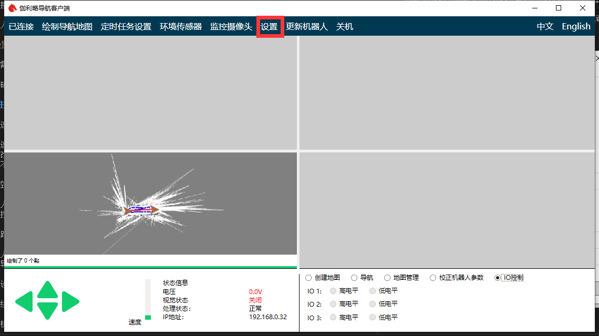
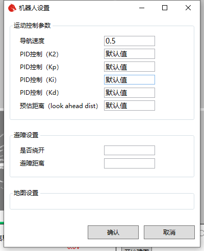

# Chapter6 Robot Setting

According to different application environment, the performance of robots will be different. For example, some scenes need robots to move faster, while others need robots to move more smoothly. The performance of the robot is determined by the corresponding parameters. Through the robot parameter modification interface, we can easily modify the parameters of the robot, so as to make the robot more suitable for our application scenarios.

After connecting the robot, click the setting button in the navigation bar above to open the robot setting interface.

If there is no button in the navigation bar, the robot does not support setting parameters. You can try again after updating the robot.

The setting interface is as follows

Modify the parameters that need to be changed, and then click OK to update the robot parameters.

If the confirm button is disabled, it indicates that the robot program does not support parameter modification function, and it needs to be modified again after upgrading the robot program.

## 6.1 Main parameters 

Robot Motion Params

- Navigation Speed

  The navigation speed is the target speed when the robot navigates, and it is also the maximum speed. The unit is meters per second. If the navigation speed changes little from the default value, it can be modified directly. If there are large changes, the following PID control parameters need to be modified at the same time. Otherwise, the robot may have the problem of unstable navigation.

- Max angel speed

  Unit: radian / second. Set the maximum rotation speed during navigation.

- PID parameters

  The motion control of robot adopts PID algorithm, and K2, KP, Ki, KD are related control parameters. If you are familiar with PID control algorithm, you can adjust it according to the general PID parameter calibration method. If you are not familiar with it, you'd better not change it.

- - PID(K2)

    Unit: dimensionless. The larger the value, the smaller the forward speed when turning. The recommended range is 0.3 to 2.0. If the value is too small, the turning speed will be too high to rush out of the path.

- - PID(Kp)

    Unit: dimensionless. The PID proportional control factor when deviating from the path. The recommended range is 0.3 to 2.0. The larger the value is, the greater the angular velocity of the regression path will be. If the value is too large, it will cause oscillation and make the car swing left and right. If the value is too small, it will cause the car to deviate from the path.

- - PID(Ki)

    Unit: dimensionless. The PID integral control factor when deviating from the path. In most cases, you don't need to change value.

- - PID(Kd)

    Unit: dimensionless. The PID differential control factor of deviation path. The recommended value range is - 1.0 to 2.0. This value is used to eliminate the phenomenon of angular velocity oscillation, and when the value is appropriate, it can eliminate the left and right swing when the vehicle is running in a straight line. When the value is not suitable and too high, the oscillation phenomenon of left-right oscillation will be strengthened.

- - Look ahead distance

    Unit: meter. The higher the value of the motion control parameter forward direction aiming distance is, the worse the fitting effect of the path is (when the mode is not bypassed, the traffic efficiency will be affected), but the speed will be smoother and the swing range will be smaller.

Barrier Avoidance Settings

- Get around

  If checked, it means to select the mode of detouring when encountering obstacles (if it can't be bypassed, it will stop moving until the obstacle disappears), and canceling the check means to select the mode of stopping moving when encountering obstacles (the task will continue automatically after the obstacle disappears).

- Get around radius

  Unit: meter. Only works in bypass mode. It corresponds to the "distance between the obstacle and the detour" in the above figure, and also represents half the width of the minimum passable path (for example, setting it to 0.5 m means that the minimum passing width is 1 m). This value cannot be less than half the actual width of the car.

- Robot width

  Unit: meter. It corresponds to "left obstacle avoidance distance" + "right obstacle avoidance distance" in the above figure. It is generally set as the actual width of the car.

- Robot rotate width

  Unit: meter. Represents the diagonal length of the car. When the distance between the obstacles is less than half of the set value, it cannot rotate and the angular velocity is forced to zero.

- Back time

  Unit: second. Only works in bypass mode. Indicates the maximum continuous backward time in case of no forward. It is better to set it to a small value greater than zero, otherwise the passable effect will be affected.

- Avoid distance

  Unit: meter. It corresponds to "obstacle distance ahead" in the figure above. When the safe distance between the vehicle and the obstacle is less than this value, the car cannot move forward, but it is allowed to rotate in place.

Map Setting

The robot's default navigation map and corresponding navigation path settings. When the automatic map switching function is turned on, the robot will automatically load the path corresponding to the relevant map according to the settings here. It can be used to realize the scene switching of robot automatic navigation, such as automatic switching from No.1 warehouse to No.2 warehouse. Automatically switch from the first level scene to the second level scene.