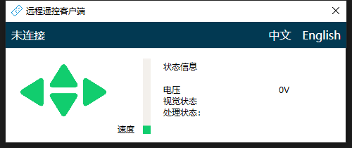
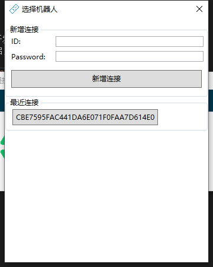
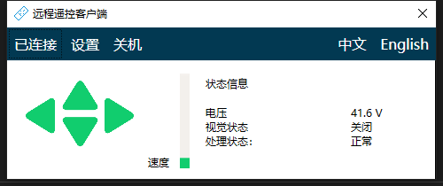

# Chapter8 Remote Control with 4G and Image

Galileo navigation system with Internet of things system, users can remote control the robot through 4G network.

## 8.1 Install

[Download](http://bwbot.org/s/tEcBiU)remote robot package and install. After installation, the interface is shown in the figure below.

## 8.2 Configuration

By default, the networking function of robots and people is turned off by default and needs to be turned on manually (for a few models, please consult the robot sales department for details)。Developers can use the [doc](http://community.bwbot.org/topic/773/) to turn on the function. General users are not recommended to open it.

After configuration, pay attention to modify the remote connection password of the robot `IOT_PASSWORD`.

## 8.3 Remote

After the robot side ensures normal operation, click the unconnected button of the client. Enter the ID and remote connection password of the robot in the pop-up window.

After the input is completed, click the Add Connection button. Under normal circumstances, the client can remotely control the robot.

After successful connection, the connection information will be automatically displayed in the recent connections list below. Next time, you can directly click the corresponding button to connect directly, no longer need to input connection information.

The client will show in the figure as the picture below after successful connection 

The speed is controlled by WSAD key on the keyboard, and the speed of robot is controlled by up and down arrow keys.
